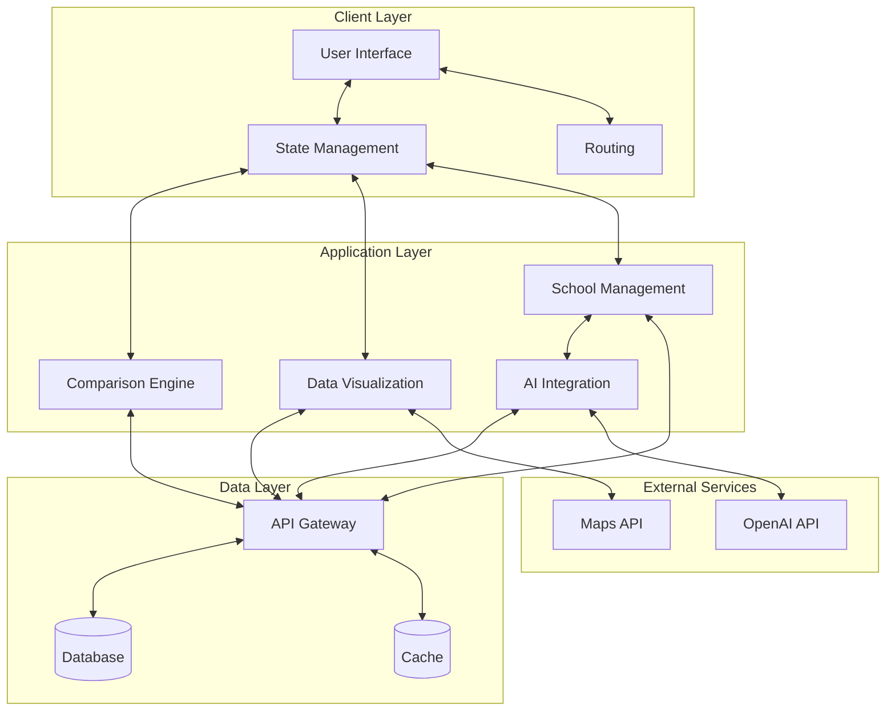

# Product Requirements Document (PRD)
# School/ELC Finder Application

## Executive Summary
This document outlines the product requirements for a web application that enables parents to find the best School or Early Learning Center (ELC) for their children based on personalized criteria weightings. The application will allow for dynamic assessment, comparative analysis, and visual representation of schools/ELCs against user-defined priorities, making the decision-making process more objective and personalized.

## Problem Statement
Parents face significant challenges when selecting the right educational institution for their children due to:
- Overwhelming number of options
- Complex, multi-faceted decision criteria (Cost, Education, Staff, Facilities, Reputation, NQS)
- Difficulty in objectively comparing institutions
- Limited tools for personalized assessment based on individual family priorities
- Time-consuming research process

This application aims to transform this complex decision-making process into a data-driven, personalized experience that helps parents confidently identify the best fit for their child based on what matters most to them.

## User Personas

### Primary Persona: Decision-Making Parent
- **Demographics**: Parents/guardians of children aged 0-18 years
- **Goals**: Find the optimal educational environment for their child's needs
- **Pain Points**: Information overload, subjective recommendations, inability to compare options objectively
- **Needs**: Data-driven comparison tools, personalized analysis, clear visualizations

### Secondary Persona: Educational Advisor
- **Demographics**: School counselors, education consultants, relocation specialists
- **Goals**: Provide data-backed recommendations to families
- **Pain Points**: Lack of tools to objectively compare institutions based on client priorities
- **Needs**: Shareable analysis, detailed comparisons, evidence-based recommendations

## User Journeys

### Journey 1: Initial Assessment
1. User lands on the application homepage
2. User navigates to the assessment section
3. User adjusts sliders to reflect their priorities for each criterion
4. Application dynamically updates the ranked list of schools/ELCs based on the weighted criteria
5. User sees the top-ranked institutions displayed visually (cards, chart, map)

### Journey 2: Refining and Exploring Results
1. User reviews the initial ranked list
2. User clicks on a school/ELC card to view more details (modal or separate page)
3. User interacts with the map to see school locations
4. User interacts with the chart to understand comparative performance
5. User potentially uses a placeholder 'Add School' feature (future state: triggers URL analysis)
6. User iterates by adjusting criteria weights further to refine the search

### Journey 3: Adding a New School/ELC (Future State)
1. User accesses the 'Add School' feature
2. User inputs the URL of the school/ELC website
3. Application triggers an analysis service (e.g., using OpenAI) to extract relevant information and score the school against the criteria
4. The new school is added to the user's comparison set
5. The results are updated to include the newly added school

## Functional Requirements

### Core Functionality
1. **Dynamic Assessment System**
   - Pairwise comparison of all schools/ELCs in database (building on existing Python algorithm)
   - Real-time calculation based on user-defined weights for 6 key criteria (Cost, Education, Staff, Facilities, Reputation, NQS)
   - Computation of both composite scores and pairwise wins as in the existing analysis

2. **Interactive User Interface**
   - Criteria sliders with intuitive UI for weight adjustment (1-5 range for each of the 6 criteria)
   - Real-time updates to visualizations and analysis reflecting the weighted algorithm
   - Mobile-responsive design adhering to shadcn/ui standards

3. **School/ELC Database**
   - Comprehensive database of institutions (starting with the 24 ELCs in the existing dataset)
   - Storage of scores (1-5) for each of the 6 assessment criteria
   - Fast read/write performance for real-time calculations

4. **Analysis & Visualization**
   - Clear, intuitive visualizations of comparative analysis
   - Multiple view options (rankings, comparison charts, etc.)
   - Filtering and sorting capabilities

5. **Insights & Commentary**
   - AI-generated insights explaining key differentiators
   - Highlighting of strengths/weaknesses based on user priorities
   - Plain-language explanations of analysis results

6. **New School Analysis**
   - URL input field for new school websites
   - OpenAI API integration for automated analysis and scoring against the 6 criteria
   - Addition of new schools to comparison database with automatic scoring (1-5) for each criterion

### Technical Requirements

*(For a detailed technical architecture, please refer to [SOLUTION_ARCH.md](./SOLUTION_ARCH.md). Ensure diagrams and specifications are kept synchronized between these documents.)*

#### Architecture Overview (Target State)

#### Frontend Requirements
- **Frontend**: React application with modern component architecture (using Vite)
- **TypeScript**: For type safety
- **shadcn/ui**: Design system implementation
- **Tailwind CSS**: For styling
- **Responsive design**: For all device types
- **Map integration**: Using Leaflet/react-leaflet
- **Charting**: Using Recharts/shadcn charts
- **Optimized performance**: For slider interactions
- **Jest/React Testing Library**: For testing

2.  **Backend** (Future Phase - Currently Frontend Only)
    *   TBD (Potentially Node.js/Express or Next.js API routes if needed)
    *   RESTful API design
    *   OpenAI API integration
    *   Authentication system (for saved preferences)

3.  **Data Processing**
    *   Efficient algorithms for pairwise comparisons
    *   Real-time calculation engine
    *   Caching strategy for performance optimization
    *   Initial data processing via Python script (`generate_json.py`). Core comparison logic implemented in frontend JavaScript/TypeScript.

4.  **Security & Privacy**
    *   User data protection
    *   API key security
    *   GDPR/CCPA compliance where applicable

5.  **Performance**
    *   <200ms response time for slider adjustments
    *   <2s load time for initial page render
    *   <5s processing time for new school URL analysis

## UI/UX Requirements

### Design System
- Implementation of shadcn/ui components and design patterns
- Consistent typography, color scheme, and spacing
- Accessible design meeting WCAG 2.1 AA standards

### Key Interface Elements
1. **Criteria Slider Panel**
   - Range sliders for the 6 assessment criteria (Cost, Education, Staff, Facilities, Reputation, NQS)
   - Visual indicator of current weighting
   - Reset/default options (equal weights of 1 for each criterion)

2. **Results Visualization Area**
   - Primary ranking display (sorted by Composite score and PairwiseWins as in sample_ranking_equal_weights.csv)
   - Detailed comparison charts (similar to composite_bar_equal_weights.png)
   - School/ELC profile cards with individual criterion scores

3. **Insights Panel**
   - AI-generated commentary
   - Key differentiators
   - Recommendation highlights

4. **URL Input Section**
   - Text input for new school URLs
   - Processing indicator
   - Success/failure feedback

### User Experience Flow
- Intuitive progression from criteria selection to results
- Minimal friction points in the assessment process
- Clear feedback for all user interactions
- Guided experience for first-time users

## Non-Functional Requirements

### Performance
- Real-time updates without perceptible lag
- Efficient handling of large datasets
- Optimized mobile performance

### Scalability
- Support for growing database of schools/ELCs
- Architecture that can handle increased user load
- Expandable criteria system

### Accessibility
- WCAG 2.1 AA compliance
- Screen reader compatibility
- Keyboard navigation support
- Color contrast requirements

### Security
- Data encryption
- Secure API calls
- User data protection

## Success Metrics

### User Success
- Time to complete first assessment
- Return rate
- Feature utilization rate
- User satisfaction surveys

### Business Success
- User acquisition
- Engagement metrics
- Conversion rate (if monetization is planned)
- Cost per acquisition

## Implementation Considerations

### Technology Stack
- **Frontend**: React, TypeScript, Vite, Tailwind CSS, shadcn/ui, Recharts, Leaflet, react-leaflet, Jest, React Testing Library
- **Backend**: TBD (Potentially Node.js/Express or Next.js API routes if needed)
- **Database**: TBD (Currently uses static `schools.json` file)
- **Data Processing**: Initial data processing via Python script (`generate_json.py`). Core comparison logic implemented in frontend JavaScript/TypeScript.
- **APIs**: TBD (OpenAI potentially in future phase)
- **Hosting/Deployment**: TBD (Vercel/Netlify suitable for static/frontend)

### Development Phases

#### Phase 1: MVP (Largely Complete)
- Core comparison engine (implemented in frontend)
- Basic UI with sliders, cards, chart, map (implemented)
- Pre-loaded school database (via `schools.json` generated from CSV)
- Simple visualizations (chart and map implemented)
- Basic testing setup (Jest/RTL configured)

#### Phase 2: Enhanced Features
- Advanced visualizations
- AI-generated insights
- Performance optimizations
- User accounts

#### Phase 3: Full Feature Set
- New school URL analysis
- Expanded database
- Advanced filtering and sorting
- Sharing capabilities

## Risks and Mitigations

| Risk | Probability | Impact | Mitigation |
|------|------------|--------|------------|
| Performance issues with large datasets | Medium | High | Implement efficient algorithms, pagination, caching |
| OpenAI API limitations | Medium | Medium | Build fallback mechanisms, implement rate limiting |
| Data accuracy for schools | High | High | Regular database updates, user feedback mechanisms |
| Complex UI overwhelming users | Medium | High | User testing, progressive disclosure, guided tours |
| Browser compatibility issues | Low | Medium | Cross-browser testing, progressive enhancement |

## Future Considerations
- Mobile app version
- Integration with school application systems
- Community features and parent reviews
- Expanded criteria based on user feedback
- Premium features for educational advisors

## Appendix
- Assessment criteria definitions
- Pairwise comparison methodology
- Ranking algorithm details
- User research findings
