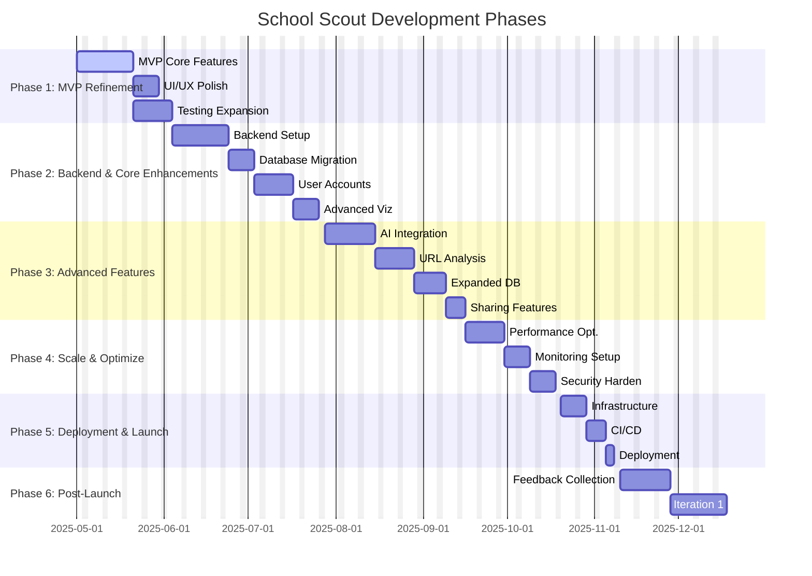

# Project Tasks Breakdown
# School Scout Application

This document provides a comprehensive breakdown of all tasks required to build the School/ELC Finder application. Tasks are organized hierarchically by phase and functional area.

*(For detailed product requirements, user journeys, and initial planning, refer to [PLANNING.md](./PLANNING.md). For the detailed technical architecture, see [SOLUTION_ARCH.md](./SOLUTION_ARCH.md). Please ensure phase names and overall scope remain synchronized across these documents.)*

## High-Level Project Plan

*Note: Dates are illustrative and represent relative sequencing and effort.* 

## 1. Project Setup & Planning

### 1.1 Environment Setup
- [x] 1.1.1 Create GitHub repository
- [x] 1.1.2 Set up project structure
- [x] 1.1.3 Configure build system (Vite recommended)
- [x] 1.1.4 Set up linting and formatting (ESLint, Prettier)
- [x] 1.1.5 Configure TypeScript
- [x] 1.1.6 Set up testing framework (Jest, React Testing Library)

### 1.2 Design Planning
- [x] 1.2.1 Review existing criteria from provided files (Cost, Education, Staff, Facilities, Reputation, NQS)
- [ ] 1.2.2 Create wireframes for main application screens
- [ ] 1.2.3 Design component architecture
- [ ] 1.2.4 Define shadcn/ui implementation plan
- [ ] 1.2.5 Create UI style guide
- [ ] 1.2.6 Design responsive layouts

### 1.3 Technical Architecture
- [x] 1.3.1 Define data models (based on centre_scores.csv structure)
- [ ] 1.3.2 Design database schema
- [ ] 1.3.3 Plan API endpoints
- [x] 1.3.4 Design state management approach (React Context/State)
- [x] 1.3.5 Document technical requirements (in PLANNING.md)

## 2. Database Implementation

### 2.1 Database Setup
- [ ] 2.1.1 Select and provision database (MongoDB/PostgreSQL)
- [ ] 2.1.2 Configure database connection
- [ ] 2.1.3 Set up database migration system
- [ ] 2.1.4 Implement data backup strategy
- [ ] 2.1.5 Configure database security

### 2.2 Data Models & Schema
- [ ] 2.2.1 Create Schools/ELCs model (with 6 assessment criteria scores)
- [ ] 2.2.2 Create Assessment Criteria model (for the 6 criteria weightings)
- [ ] 2.2.3 Create User Preferences model (if applicable)
- [ ] 2.2.4 Set up relations between models
- [ ] 2.2.5 Implement validation rules (ensure scores are 1-5)

### 2.3 Data Population
- [x] 2.3.1 Create data import scripts (`generate_json.py` created)
- [x] 2.3.2 Import initial School/ELC dataset (`generate_json.py` script populates `app/schools.json` from `centre_scores.csv`)
- [ ] 2.3.3 Import assessment criteria data (6 criteria with default weights of 1)
- [ ] 2.3.4 Verify data integrity
- [ ] 2.3.5 Create seed data for development

## 3. Backend Development

### 3.1 API Development
- [ ] 3.1.1 Set up API server (Express/Next.js API routes)
- [ ] 3.1.2 Implement Schools/ELCs endpoints (CRUD)
- [ ] 3.1.3 Implement criteria endpoints
- [ ] 3.1.4 Create analysis calculation endpoints
- [ ] 3.1.5 Set up error handling middleware
- [ ] 3.1.6 Implement request validation

### 3.2 Analysis Engine
- [ ] 3.2.1 Port Python pairwise comparison algorithm from analysis.py to JavaScript
- [ ] 3.2.2 Implement composite score calculation with weighted criteria
- [ ] 3.2.3 Build pairwise wins calculation algorithm
- [ ] 3.2.4 Optimize performance for real-time calculations
- [ ] 3.2.5 Implement caching strategy

### 3.3 OpenAI Integration
- [ ] 3.3.1 Set up OpenAI API client
- [ ] 3.3.2 Create website content extraction service
- [ ] 3.3.3 Develop prompt engineering for ELC analysis against the 6 criteria
- [ ] 3.3.4 Implement response parsing logic
- [ ] 3.3.5 Build algorithm to score new ELCs from 1-5 on each criterion
- [ ] 3.3.6 Add rate limiting and error handling

### 3.4 Insights Generation
- [ ] 3.4.1 Design insights generation algorithm
- [ ] 3.4.2 Implement comparative analysis logic
- [ ] 3.4.3 Create natural language generation for insights
- [ ] 3.4.4 Build strength/weakness identification system
- [ ] 3.4.5 Implement recommendations logic

## 4. Frontend Development

### 4.1 UI Implementation
- [x] 4.1.1 Develop Homepage Layout
- [~] 4.1.2 Implement Assessment UI (Sliders, Criteria)
  - [x] 4.1.2.1 Make header buttons functional (Settings, User)
- [x] 4.1.3 Design Results Page Layout
- [ ] 4.1.4 Develop School/ELC Details Modal/Page UI
- [x] 4.1.5 Implement Comparison Chart UI (using shadcn/ui)
- [x] 4.1.6 Refine Assessment Criteria sidebar UI (Spacing, Text, Labels)
- [x] 4.1.7 Add 'Add School' Card UI

### 4.2 Component Development
- [x] 4.2.1 Create Slider component (using shadcn/ui)
- [x] 4.2.2 Implement Card component (using shadcn/ui)
- [ ] 4.2.3 Develop Chart component (using shadcn/ui & Recharts)
- [ ] 4.2.4 Create School/ELC Details component
- [x] 4.2.5 Implement Input component (using shadcn/ui)
- [x] 4.2.6 Implement Button component (using shadcn/ui)
- [x] 4.2.7 Implement Label component (using shadcn/ui)

### 4.3 Multi-Page Navigation & Core Pages
- [x] 4.3.1 Setup react-router-dom
- [x] 4.3.2 Create basic page components (Dashboard, Schools, Tasks, News, About)
- [x] 4.3.3 Refactor App.tsx and MainLayout.tsx for nested routing
- [x] 4.3.4 Add navigation links to Header component
- [x] 4.3.5 Implement basic placeholder content for SchoolsPage (Card grid)
- [x] 4.3.6 Implement basic placeholder content for TasksPage (Table)
- [x] 4.3.7 Implement basic placeholder content for NewsPage (Card feed)
- [x] 4.3.8 Implement basic placeholder content for AboutPage (Card + Background)

### 4.4 State Management
- [ ] 4.4.1 Implement state logic for assessment criteria weights
- [ ] 4.4.2 Create schools data state
- [ ] 4.4.3 Build analysis results state
- [ ] 4.4.4 Implement user preferences state
- [ ] 4.4.5 Create loading/error states

### 4.5 Visualization Components
- [x] 4.5.1 Implement ranking visualization (similar to sample_ranking_equal_weights.csv) // Complete
- [ ] 4.5.2 Create comparison chart components (similar to composite_bar_equal_weights.png)
- [ ] 4.5.3 Build radar/spider chart for criteria comparison across ELCs
- [ ] 4.5.4 Develop detailed ELC profile view showing all scores
- [ ] 4.5.5 Implement insights display components

### 4.6 Interactive Features
- [ ] 4.6.1 Implement real-time slider updates
- [ ] 4.6.2 Create drag-and-drop functionality (if applicable)
- [ ] 4.6.3 Build filtering and sorting controls
- [ ] 4.6.4 Implement save/share functionality
- [ ] 4.6.5 Add animations and transitions

## 5. Integration & Testing

### 5.1 Frontend-Backend Integration
- [ ] 5.1.1 Connect API client to backend endpoints
- [ ] 5.1.2 Implement data fetching logic
- [ ] 5.1.3 Add error handling for API requests
- [ ] 5.1.4 Optimize data loading strategies
- [ ] 5.1.5 Implement real-time updates

### 5.2 Unit Testing
- [x] 5.2.1 Set up Jest and React Testing Library
- [x] 5.2.2 Write basic tests for core components (e.g., AssessmentCriteria)
- [ ] 5.2.3 Write tests for utility functions
- [ ] 5.2.4 Write tests for state management logic
- [ ] 5.2.5 Achieve target code coverage (e.g., 70%)

### 5.3 Integration Testing
- [ ] 5.3.1 Test end-to-end user flows
- [ ] 5.3.2 Verify real-time calculations
- [ ] 5.3.3 Test new school URL analysis
- [ ] 5.3.4 Validate insights generation
- [ ] 5.3.5 Test cross-browser compatibility

### 5.4 Performance Testing
- [ ] 5.4.1 Measure and optimize load times
- [ ] 5.4.2 Test slider interaction performance
- [ ] 5.4.3 Evaluate database query performance
- [ ] 5.4.4 Optimize bundle size
- [ ] 5.4.5 Test mobile performance

## 6. Deployment & DevOps

### 6.1 Infrastructure Setup
- [ ] 6.1.1 Provision hosting environment (Vercel/AWS)
- [ ] 6.1.2 Configure CI/CD pipeline
- [ ] 6.1.3 Set up environment variables
- [ ] 6.1.4 Configure domains and SSL
- [ ] 6.1.5 Implement monitoring tools

### 6.2 Deployment Procedure
- [ ] 6.2.1 Create deployment scripts
- [ ] 6.2.2 Set up staging environment
- [ ] 6.2.3 Configure production deployment
- [ ] 6.2.4 Implement database migration procedure
- [ ] 6.2.5 Create rollback strategy

### 6.3 Monitoring & Maintenance
- [ ] 6.3.1 Set up error tracking (Sentry)
- [ ] 6.3.2 Implement analytics
- [ ] 6.3.3 Create health check endpoints
- [ ] 6.3.4 Set up automated backups
- [ ] 6.3.5 Implement logging system

## 7. Documentation & Handoff

### 7.1 Technical Documentation
- [ ] 7.1.1 Document API endpoints
- [ ] 7.1.2 Create algorithm documentation
- [ ] 7.1.3 Document database schema
- [ ] 7.1.4 Write deployment instructions
- [ ] 7.1.5 Document OpenAI integration

### 7.2 User Documentation
- [ ] 7.2.1 Create user guide
- [ ] 7.2.2 Document feature explanations
- [ ] 7.2.3 Write FAQ section
- [ ] 7.2.4 Create video tutorials (if applicable)
- [ ] 7.2.5 Document accessibility features

### 7.3 Developer Handoff
- [ ] 7.3.1 Conduct codebase walkthrough
- [ ] 7.3.2 Create known issues list
- [ ] 7.3.3 Document future enhancement opportunities
- [ ] 7.3.4 Transfer repository ownership (if applicable)
- [ ] 7.3.5 Complete final knowledge transfer sessions

## 8. Post-Launch

### 8.1 User Feedback Collection
- [ ] 8.1.1 Implement feedback mechanism
- [ ] 8.1.2 Create user satisfaction survey
- [ ] 8.1.3 Set up analytics events
- [ ] 8.1.4 Monitor user behavior
- [ ] 8.1.5 Establish feedback triage process

### 8.2 Iterative Improvements
- [ ] 8.2.1 Prioritize enhancement requests
- [ ] 8.2.2 Plan iteration cycles
- [ ] 8.2.3 Implement high-priority fixes
- [ ] 8.2.4 Add refinements based on user feedback
- [ ] 8.2.5 Update documentation with changes
