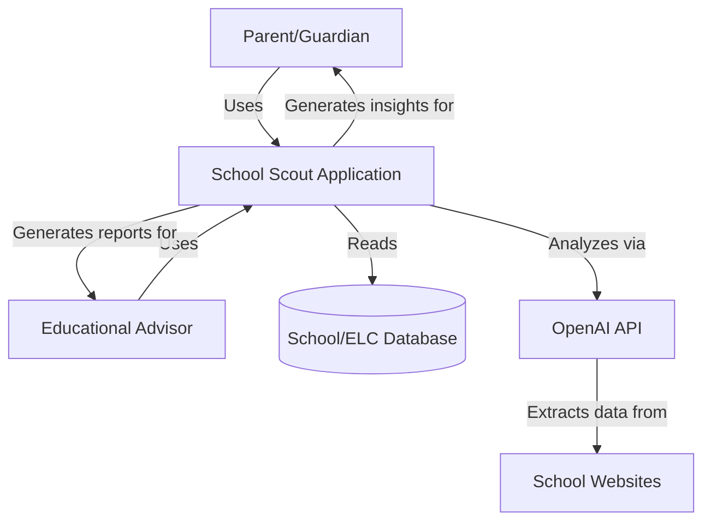
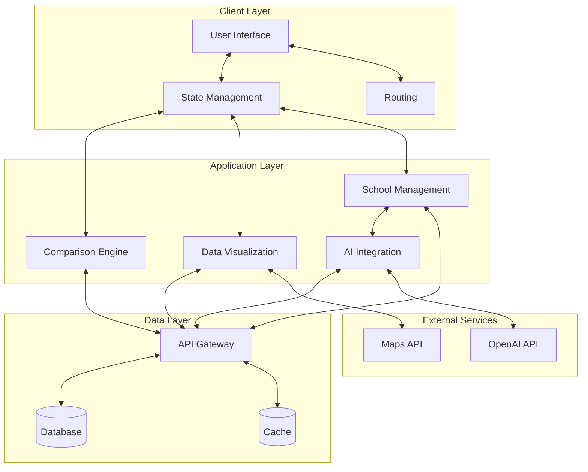
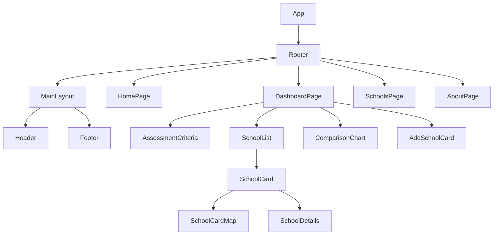
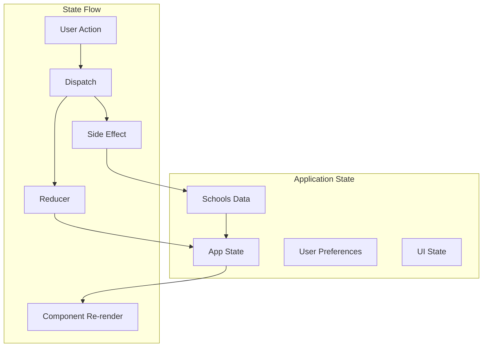
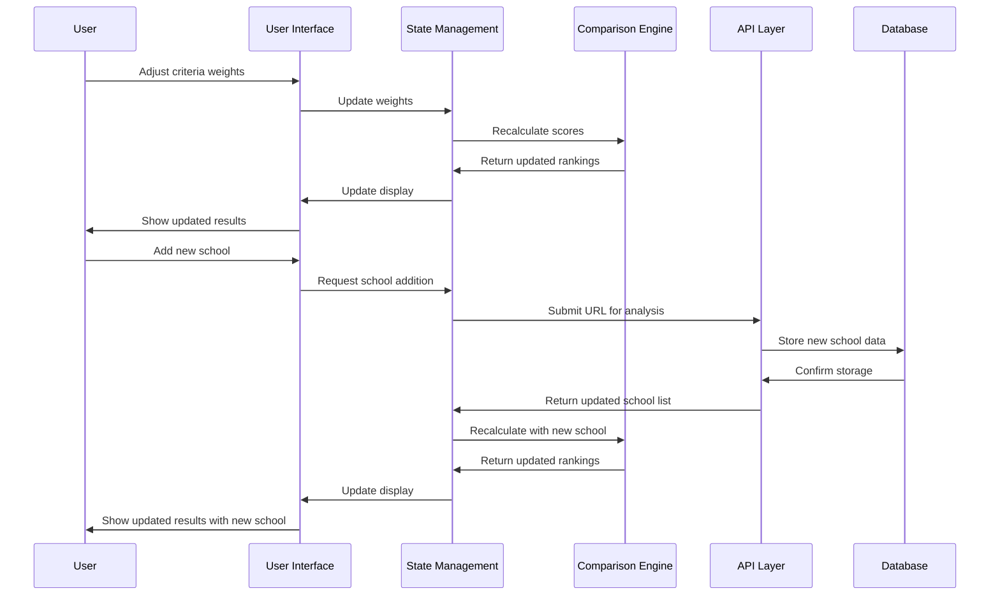
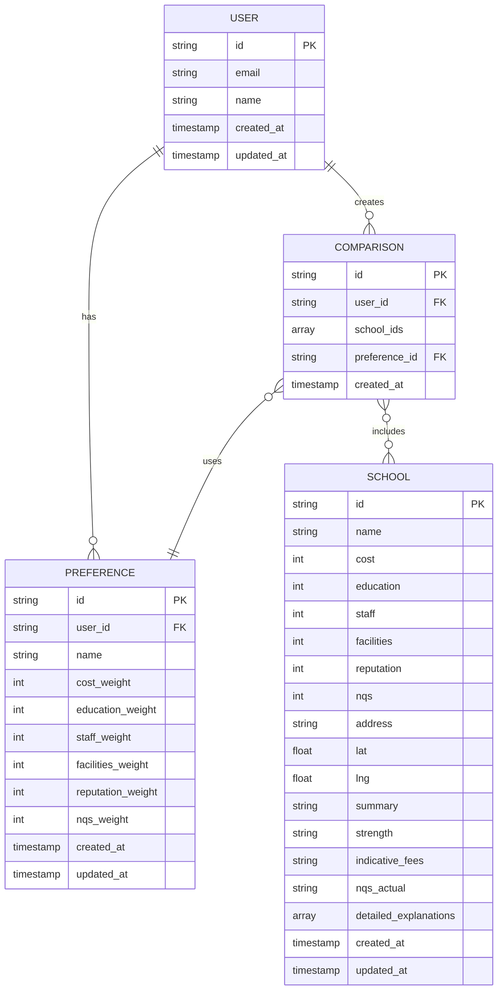
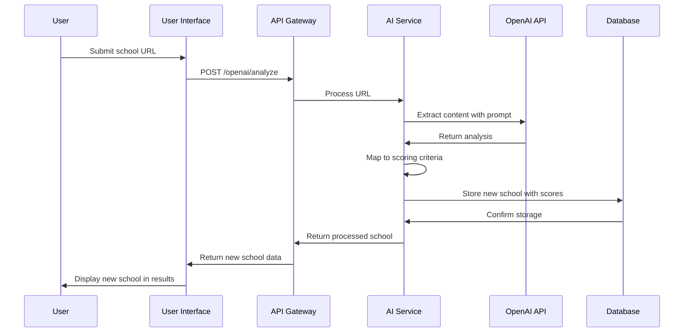
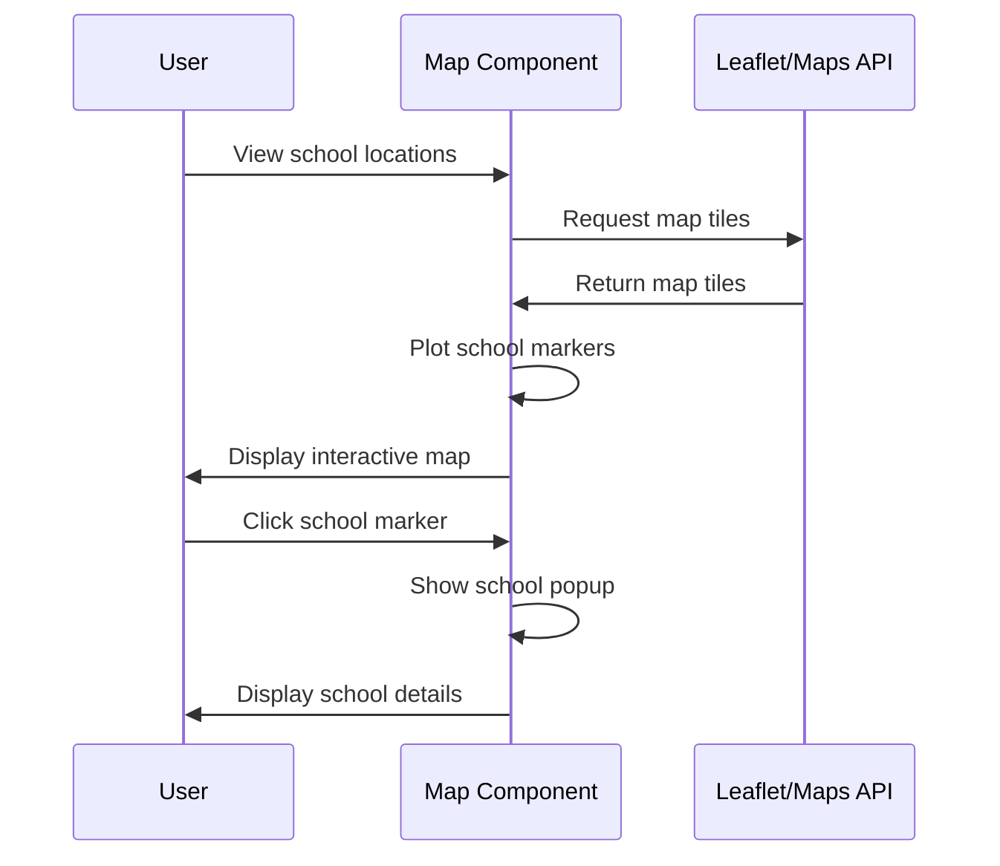
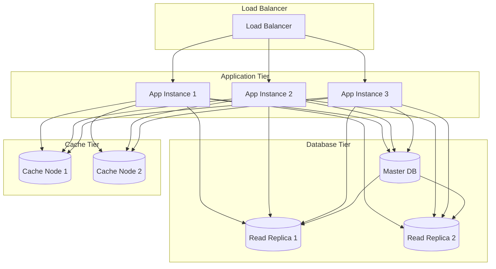
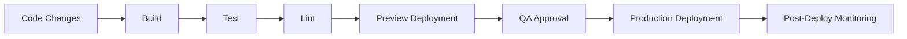

# School Scout - Solution Architecture

## 1. Executive Summary

This document provides a comprehensive solution architecture for the School Scout application, a tool designed to help parents compare and evaluate schools and early learning centers (ELCs) based on personalized criteria weightings. The solution architecture addresses both the current MVP implementation and the target state architecture to support future growth and feature expansion.

## 2. System Context

### 2.1 Business Context

School Scout aims to transform the complex decision-making process of selecting educational institutions into a data-driven, personalized experience. The application serves:

- **Primary Users**: Parents/guardians seeking educational institutions for their children
- **Secondary Users**: Educational advisors providing recommendations to families

### 2.2 System Context Diagram



## 3. Architecture Principles

### 3.1 Guiding Principles

1. **User-Centric Design**: Prioritize intuitive interfaces and meaningful interactions
2. **Data-Driven Decision Making**: Enable objective comparisons through quantifiable metrics
3. **Scalability**: Design for growth in user base and feature set
4. **Performance**: Ensure responsive UI and efficient calculations
5. **Maintainability**: Follow clean code practices and comprehensive documentation
6. **Security**: Protect user data and API integrations
7. **Accessibility**: Ensure WCAG 2.1 AA compliance

### 3.2 Technical Principles

1. **Component-Based Architecture**: Use React components for modularity and reusability
2. **Static-First Approach**: Prioritize static generation where possible for performance
3. **Progressive Enhancement**: Core functionality works without JavaScript, enhanced with it
4. **API-First Design**: Well-defined interfaces between frontend and backend
5. **Responsive by Default**: Mobile-first design approach
6. **Test-Driven Development**: Comprehensive test coverage

## 4. Solution Overview

### 4.1 High-Level Architecture

*(Note: This diagram is replicated in [README.md](./README.md). Please ensure any updates are synchronized between both files.)*



### 4.2 Current vs. Target State

**Current State (MVP):**
- Frontend-only React application
- Static JSON data source
- Core comparison engine in JavaScript
- Basic visualization with charts and maps
- No user accounts or persistence

**Target State:**
- Full-stack application with API backend
- Database for school/ELC data and user preferences
- AI integration for school analysis
- Advanced visualizations and insights
- User accounts and preference saving

## 5. Detailed Architecture

### 5.1 Frontend Architecture

#### 5.1.1 Component Architecture



#### 5.1.2 State Management



#### 5.1.3 Data Flow



### 5.2 Backend Architecture (Target State)

#### 5.2.1 API Design

```mermaid
graph LR
    subgraph "API Gateway"
        Auth[Authentication]
        Rate[Rate Limiting]
        Logging[Logging]
        Routing[Routing]
    end
    
    subgraph "API Endpoints"
        Schools[/schools]
        SchoolById[/schools/:id]
        Criteria[/criteria]
        UserPrefs[/user/preferences]
        Analysis[/analysis]
        OpenAI[/openai/analyze]
    end
    
    subgraph "Services"
        SchoolService[School Service]
        UserService[User Service]
        AnalysisService[Analysis Service]
        AIService[AI Service]
    end
    
    Client[Client Application]
    
    Client --> Auth
    Auth --> Rate
    Rate --> Logging
    Logging --> Routing
    
    Routing --> Schools
    Routing --> SchoolById
    Routing --> Criteria
    Routing --> UserPrefs
    Routing --> Analysis
    Routing --> OpenAI
    
    Schools --> SchoolService
    SchoolById --> SchoolService
    Criteria --> SchoolService
    UserPrefs --> UserService
    Analysis --> AnalysisService
    OpenAI --> AIService
```

#### 5.2.2 Database Schema



### 5.3 Integration Architecture

#### 5.3.1 OpenAI Integration



#### 5.3.2 Maps Integration



## 6. Technical Specifications

### 6.1 Frontend Specifications

| Component | Technology | Description |
|-----------|------------|-------------|
| Framework | React 19.0.0 | Core UI library |
| Build Tool | Vite 6.3.1 | Fast build and dev experience |
| Language | TypeScript 5.7.2 | Type-safe JavaScript |
| Styling | Tailwind CSS 3.4.0 | Utility-first CSS framework |
| Component Library | shadcn/ui | Accessible, customizable components |
| Routing | React Router 7.5.3 | Client-side routing |
| State Management | React Context/Hooks | State management without Redux |
| Charts | Recharts 2.15.3 | Responsive chart components |
| Maps | Leaflet 1.9.4 / react-leaflet 5.0.0 | Interactive maps |
| Icons | lucide-react 0.507.0 | SVG icon components |
| Testing | Jest 29.7.0 / React Testing Library 16.3.0 | Unit and component testing |

### 6.2 Backend Specifications (Target State)

| Component | Technology | Description |
|-----------|------------|-------------|
| API Framework | Node.js / Express or Next.js API Routes | RESTful API implementation |
| Database | MongoDB or PostgreSQL | Data persistence |
| ORM/ODM | Mongoose or Prisma | Database access layer |
| Authentication | JWT / Auth0 | User authentication |
| Caching | Redis | Performance optimization |
| API Documentation | Swagger / OpenAPI | API documentation |
| Logging | Winston / Pino | Application logging |
| Monitoring | Prometheus / Grafana | System monitoring |

### 6.3 DevOps Specifications (Target State)

| Component | Technology | Description |
|-----------|------------|-------------|
| CI/CD | GitHub Actions | Continuous integration and deployment |
| Hosting | Vercel / Netlify | Frontend hosting |
| Backend Hosting | AWS / GCP / Azure | Backend services |
| Containerization | Docker | Application containerization |
| Orchestration | Kubernetes (optional) | Container orchestration |
| Monitoring | Sentry | Error tracking |
| Analytics | Google Analytics / Plausible | User analytics |

## 7. Performance Considerations

### 7.1 Frontend Performance

1. **Bundle Optimization**
   - Code splitting by route
   - Tree shaking unused code
   - Dynamic imports for large components
   - Proper dependency management

2. **Rendering Optimization**
   - Memoization of expensive calculations
   - Virtualization for long lists
   - Lazy loading of off-screen components
   - Debouncing user input (especially sliders)

3. **Asset Optimization**
   - Image optimization and proper sizing
   - Font subsetting
   - SVG optimization
   - Preloading critical assets

### 7.2 Backend Performance (Target State)

1. **Database Optimization**
   - Proper indexing
   - Query optimization
   - Connection pooling
   - Sharding for horizontal scaling (future)

2. **Caching Strategy**
   - Response caching
   - Computation result caching
   - Cache invalidation strategy
   - Multi-level caching (memory, Redis)

3. **API Optimization**
   - Pagination
   - Field selection
   - Compression
   - Rate limiting

## 8. Security Considerations

### 8.1 Frontend Security

1. **Input Validation**
   - Client-side validation
   - XSS prevention
   - CSRF protection
   - Content Security Policy

2. **Authentication & Authorization**
   - Secure token storage
   - Token refresh strategy
   - Role-based access control
   - Session management

3. **Secure Communication**
   - HTTPS only
   - Secure cookies
   - API key protection

### 8.2 Backend Security (Target State)

1. **API Security**
   - Authentication middleware
   - Rate limiting
   - Input sanitization
   - Parameter validation

2. **Data Protection**
   - Encryption at rest
   - Encryption in transit
   - PII handling
   - GDPR compliance

3. **Infrastructure Security**
   - Firewall configuration
   - Network isolation
   - Least privilege principle
   - Regular security audits

## 9. Scalability Considerations

### 9.1 Vertical Scaling

- Increase resources (CPU, memory) for existing servers
- Optimize code for better resource utilization
- Improve database query performance

### 9.2 Horizontal Scaling (Target State)

- Stateless application design
- Load balancing across multiple instances
- Database read replicas
- Sharding for write-heavy workloads
- Microservices architecture for specific components



## 10. Monitoring and Observability

### 10.1 Application Monitoring

- Error tracking with Sentry
- Performance monitoring with Lighthouse/Web Vitals
- User behavior analytics
- Feature usage tracking

### 10.2 Infrastructure Monitoring (Target State)

- Server metrics (CPU, memory, disk)
- Database performance metrics
- API response times and error rates
- Cache hit/miss rates
- Custom business metrics

### 10.3 Logging Strategy

- Structured logging format (JSON)
- Log levels (DEBUG, INFO, WARN, ERROR)
- Centralized log storage
- Log retention policy
- Correlation IDs for request tracing

## 11. Deployment Strategy

### 11.1 Environments

- Development
- Testing/QA
- Staging
- Production

### 11.2 CI/CD Pipeline



### 11.3 Rollback Strategy

- Versioned deployments
- Blue/Green deployment
- Canary releases
- Automated rollback triggers

## 12. Implementation Roadmap

### 12.1 Phase 1: MVP Refinement (Current)

- Optimize current frontend implementation
- Expand test coverage
- Improve UI/UX based on feedback
- Enhance data visualization

### 12.2 Phase 2: Backend Implementation

- Set up API infrastructure
- Implement database schema
- Migrate from static JSON to dynamic data
- Add basic user accounts

### 12.3 Phase 3: Advanced Features

- Implement OpenAI integration
- Add school URL analysis
- Enhance comparison algorithm
- Implement advanced visualizations

### 12.4 Phase 4: Scale and Optimize

- Performance optimization
- Monitoring implementation
- Security hardening
- Scalability improvements

## 13. Risk Assessment and Mitigation

| Risk | Impact | Probability | Mitigation |
|------|--------|------------|------------|
| Performance degradation with large datasets | High | Medium | Implement pagination, virtualization, and efficient algorithms |
| OpenAI API cost and rate limits | Medium | High | Implement caching, rate limiting, and fallback mechanisms |
| User adoption challenges | High | Medium | Focus on UX, conduct usability testing, iterate based on feedback |
| Data accuracy and freshness | High | High | Implement data validation, regular updates, and user feedback mechanisms |
| Security vulnerabilities | High | Low | Regular security audits, dependency updates, and secure coding practices |

## 14. Appendix

### 14.1 Technology Stack Details

Detailed specifications of all technologies used in the solution.

### 14.2 API Documentation

OpenAPI/Swagger documentation for all API endpoints.

### 14.3 Database Schema Details

Complete database schema with field types, constraints, and relationships.

### 14.4 Component Specifications

Detailed specifications for each UI component including props, state, and behaviors.

### 14.5 Algorithm Documentation

Documentation of the comparison algorithm, scoring methodology, and ranking system.